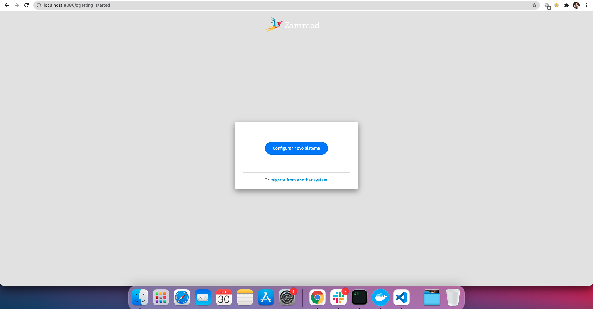
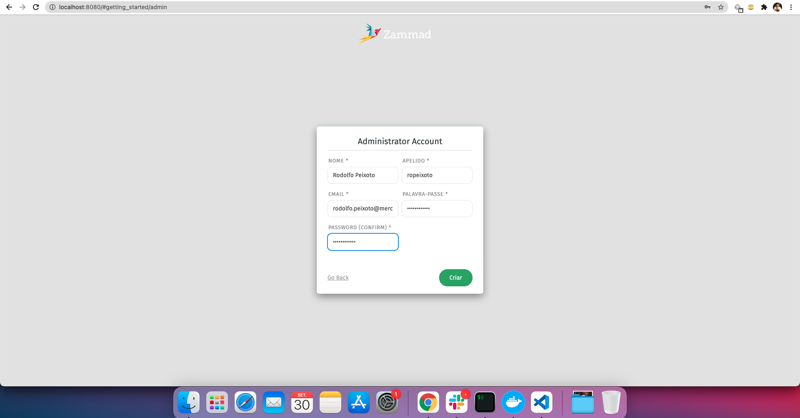
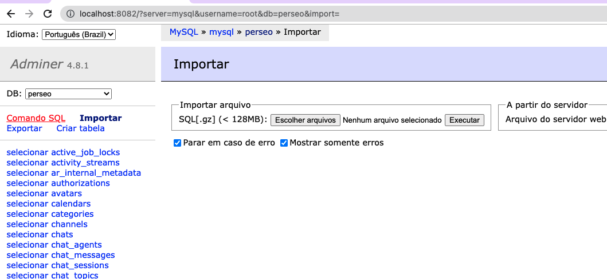

# PerseoPack

The project created for manager dependencies and apps perseo.

## Requirements

 * Fury
 * Docker and Docker Compose

## Setup

1. Clone the project perseo pack.

```s
  $ git clone
```

2. Get project perseo and perseo-react in folder perseo pack.

 ```s
  $ cd perseo-pack
  
  $ fury get perseo

  $ fury get perseo-react

 ```

 In folder perse/config/database.yml setup development and test:


 ```yml
  default: &default
  pool: <%= ENV['DB_POOL'] || ENV['MAX_THREADS'] || 10 %>
  timeout: 5000
  encoding: utf8
  reconnect: true
  adapter: mysql2

development:
  <<: *default
  database: perseo
  username: root
  password: Mysql2021!
  host: mysql
  port: 3306

test:
  <<: *default
  database: perseo_test
  username: root
  password: SENHA
  host: localhost
  port: 3306
 ```

3. Run the commands:

Up all services

```s
  $ docker-compose up --build
```

waiting services up

4. Go to localhost:8080 to configure zammad.

Step in images:

1.  Click in button:




2. Add the information and in `apelido` save this name, as we will use.




3. Configure the company


Let's create a fake token for us to use local. In localhost:8082 acess the adminer:

```s
servidor: mysql
username: root
password: Mysql2021!
database: perseo
```


Click in `Comando SQL`:




Add the command below, but you need to change the `username` to `apelido` added to the configuration, change `ropeixoto` to `apelido`, example: `VALUES (1, 3, 1,'ropeixoto','api','Argos Token'` to `VALUES (1, 3, 1,'apelido','api','Argos Token'`

Command SQL:

```SQL
INSERT INTO tokens(id, user_id, persistent, name, action, label, preferences, last_used_at, expires_at, created_at, updated_at)
VALUES (1, 3, 1,'ropeixoto','api','Argos Token',
'--- !ruby/hash:ActiveSupport::HashWithIndifferentAccess
permission:
- user_preferences
','2021-09-24 19:55:34.682','2030-05-27','2021-05-26 15:31:50.848','2021-09-24 19:55:34.683');
```


In project perse-react, file: `perseo-react/src/index.js`, change token to `apelido` and `username` to `apelido` too, like below:

```js
// perseo-react/src/index.js

<PerseoApplication token={'ropeixoto'} organizationId="1" username="ropeixoto" local />
```

## Informations

We have the following services in the compose:

 web: Ruby on Rails [ BACKEND ]
 react: React [ FRONTEND ]
 mysql: MySQL [ DATABASE ]
 adminer: MANAGER MYSQL

endpoints:
  
  1. localhost:8080 -> Ruby on Rails
  2. localhost:3000 -> React
  3. localhost:8082 -> Database manager in UI [ Adminer ]


